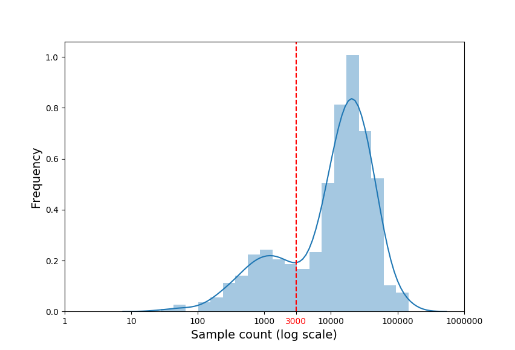

Read demultiplexing
===================

Pre-requisites
--------------

- `Nextflow <https://www.nextflow.io/docs/latest/getstarted.html>`_
- python(>=3.6) + libraries: Biopython, pandas, numpy, matplotlib, seaborn, argparse

Usage
-----

Clone the repository:

.. code-block:: bash

    git clone https://github.com/hawaiidatascience/nextflow_cmaiki.git
	cd nextflow_cmaiki/metagenomics-pipelines

Running the pipeline
^^^^^^^^^^^^^^^^^^^^

To run the pipeline on your data, simply enter the following command:

.. code-block:: bash

    nextflow run multithreaded-demux -profile <config> --inputdir "<path_to_reads>"

For more information about the available profiles, see the `profiles <https://metagenomics-pipelines.readthedocs.io/en/latest/getting_started.html#configuration-profiles>`_ section.

Demultiplexing steps
--------------------

The demultiplexing pipeline processes the raw fastq sequences, splits them into separate samples and provides useful plots to facilitate the downstream analysis.
The goal is to map each index read to a sample name. In the case of single barcoded reads, we only need to map one index to one barcode while in the paired case, both indexes need to map two associated barcodes. This algorithm uses a similar approach as done in `Dada2 <https://www.researchgate.net/publication/303502659_DADA2_High-resolution_sample_inference_from_Illumina_amplicon_data>`_ in that it builds an error model to calculate transition probability between 2 nucleotides using the illumina quality score. Using this model, the algorithm assign the index to the barcode with the highest likelihood. A hard threshold of 3 mismatches is set so that if an index has a distance of more than 3 to the most likely barcode, the index is dropped.

The demultiplexing algorithm is summarized below. Values in between "<" ">" correspond to default values of tunable parameters.

Inputs
^^^^^^

This algorithm is expecting 3 to 5 input files for demultiplexing depending on whether:
- Your reads are single-end or paired-end
- Your reads have single or paired index

- 1 or 2 index fastq files (unzipped) matching the glob pattern `*_I{1,2}*.fastq*`
- 1 or 2 read fastq files (unzipped) matching the glob pattern `*_R{1,2}*.fastq*`
- 1 barcode file (extension: .csv), comma separated, with no header and 2 or 3 columns: (sample name, forward barcode and the reverse complement of reverse barcode for paired index)

Matching order prediction (paired indexes only)
^^^^^^^^^^^^^^^^^^^^^^^^^^^^^^^^^^^^^^^^^^^^^^^

Due to the variability of Illumina protocols, index pairs and barcodes pairs can match in-order or in reverse order. In other words, for a given sequencing protocol, two paired index reads `(i1, i2)` and a matching barcode pair `(b1, b2)`, we can either have an in-order match `(i1, i2) = (b1, b2)` or a reversed match `(i1, i2) = (b2, b1)`. The first step of the pipeline consists in guessing this association by extracting the most frequent index pairs, and comparing it to the barcodes pair. The idea is that errors happen randomly at a low rate, and thus the most frequent pairs should be real barcodes with no errors. If the most frequent in-order pairs are among the barcodes, then we process with the in-order mapping, and with the reverse otherwise.

Error model
^^^^^^^^^^^

In order to determine the transition probability from a barcode sequence to an index read, we need to compute the probability of each of the 4 possible nucleotides (A, C, G, T) to transition to one of the 5 possibilities (A, C, G, T, N). Illumina provides quality scores linked to this probability, but it is known to be highly variable. Therefore, we build error models for the forward and reverse indexes, in a similar fashion as done in [DADA2 Ref]. For each index read,  we extract the barcodes with less than 2 mismatches,  and store the transitions between each nucleotide pair at each position along with the illumina quality score. We repeat this procedure until 100k transitions are observed. We convert the origin x mutated x quality transition matrix (4 x 5 x 40) to probabilities so that the scores from an origin to a mutated nucleotide for a given score sums up to 1. To smooth the transitions and fill the unobserved transitions, we interpolate the transitions by fitting an isotonic model for each (origin, mutated) nucleotide pair. The isotonic model makes sure the curve is monotonic, and is therefore more robust to outliers than a polynomial regression as it is done is DADA2. 

Index - Barcode matching
^^^^^^^^^^^^^^^^^^^^^^^^

This step is done on concurrent processes by splitting the original file in multiple files of fixed size (default: 100k). We compare each index read with all barcodes and extract the most likely match. To compute this probability, we use the above-mentioned error model. The probability is simply the product each transition probability between each nucleotide pair between the index and the barcode, and keep the best barcode match if there are less than 3 nucleotide mismatches between the two.
Once the mapping is done, we simply move the sequencing read to their corresponding sample file. The sequencing reads are split in the same manner as the index reads to run the demultiplexing on concurrent processes.

Figures
^^^^^^^

The pipeline provides two useful figures. First, we run the `FASTQC <https://www.bioinformatics.babraham.ac.uk/projects/fastqc/>`_ tool to provide the overall quality distribution at each read position, therefore providing the necessary information to choose the right truncation parameters when quality filtering the reads:

The second plot shows the sample size distribution (log transformed) which can be used to determine a subsampling threshold later in the analysis (see the `subsampling <https://metagenomics-pipelines.readthedocs.io/en/latest/pipeline_16S.html#subsampling>`_ section):

   Distribution of log sample sizes
